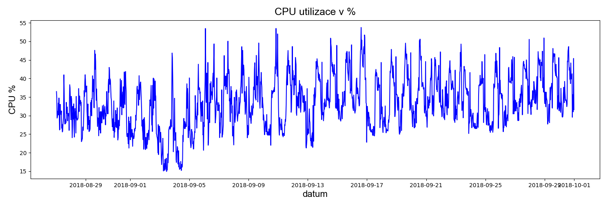

# VMware vSphere Report

This repository contains scripts for generating basic resources reports of the ESXi hosts in the virtual infrastructure.

# Requirements
pip3 install argparse matplotlib pandas

or

pip3 install -r requirements.txt

# Example usage

report-plot.py [-h] -t TYPE -f FILE

Process args for report options

optional arguments:
  -h, --help            show this help message and exit
  -t TYPE, --type TYPE  Type of the report, for example: cpu, hdd, ram, swp
  -f FILE, --file FILE  Filename of the *.csv data file

  Example:
  report-plot.py -t cpu -f esx1-cpu-report-2018-09-03.csv

  # Report

  This report generates plot of the chosen resource to the PNG file.

  

  Report also prints Max and Average values of the selected resource to the console.

# Licensing

The MIT License (MIT)

Copyright (c) 2018 Vladan Laxa

Permission is hereby granted, free of charge, to any person obtaining a copy of this software and associated documentation files (the "Software"), to deal in the Software without restriction, including without limitation the rights to use, copy, modify, merge, publish, distribute, sublicense, and/or sell copies of the Software, and to permit persons to whom the Software is furnished to do so, subject to the following conditions: The above copyright notice and this permission notice shall be included in all copies or substantial portions of the Software.

THE SOFTWARE IS PROVIDED "AS IS", WITHOUT WARRANTY OF ANY KIND, EXPRESS OR IMPLIED, INCLUDING BUT NOT LIMITED TO THE WARRANTIES OF MERCHANTABILITY, FITNESS FOR A PARTICULAR PURPOSE AND NONINFRINGEMENT. IN NO EVENT SHALL THE AUTHORS OR COPYRIGHT HOLDERS BE LIABLE FOR ANY CLAIM, DAMAGES OR OTHER LIABILITY, WHETHER IN AN ACTION OF CONTRACT, TORT OR OTHERWISE, ARISING FROM, OUT OF OR IN CONNECTION WITH THE SOFTWARE OR THE USE OR OTHER DEALINGS IN THE SOFTWARE.
